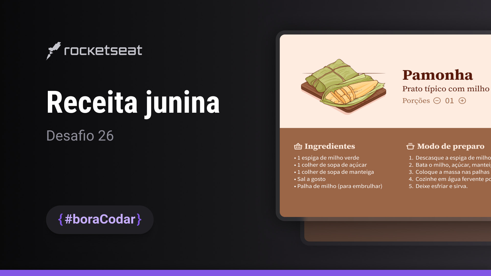

# 26

 
 

You can preview the project layout [clicking here](https://www.figma.com/community/file/1255887923488942888/Receita-Junina-%E2%80%A2-Desafio-26). Please note that a [Figma](https://figma.com) account is required to access it.

## 💻 About this project

Welcome to one of many #boraCodar challenges! 

I'll be happy if you could send me any feedback about the project, code, structure or anything that you can report that could make me better as a developer!

And you can use this project as you wish!

## 🚀 Built with

This project was built with:

- HTML
- CSS

## 📩 Reach me out

You can reach me at:

Reach me at: bw3sley@gmail.com

Connect with me at [LinkedIn](https://www.linkedin.com/in/bw3sley)

## 📝 License

This project is licensed under the MIT License - see the [LICENSE.md](../LICENSE.md) file for details.