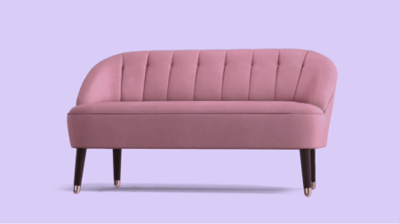

# 02

 
 

Você pode visualizar o layout do projeto [clicando aqui](https://www.figma.com/community/file/1195050984449538256/card-de-produto-desafio-02?q_id=613a32d3-f0cb-4100-8eee-7a113ef96e8a). Note que uma conta no [Figma](https://figma.com) é necessária para acessá-lo.

## 💻 Sobre o projeto

Bem-vindo a um dos muitos desafios #boraCodar!

Fico feliz se você puder me enviar algum feedback sobre o projeto, código, estrutura ou qualquer ponto que possa me ajudar a evoluir como desenvolvedor!

E você pode usar este projeto como quiser!

## 🚀 Feito com

Este projeto foi feito com:

- HTML
- CSS

## 📩 Contato

Você pode falar comigo em:

Email: bw3sley@gmail.com

Conecte-se comigo no [LinkedIn](https://www.linkedin.com/in/bw3sley)

## 📝 Licença

Este projeto está licenciado sob a Licença MIT. Veja o arquivo [LICENSE.md](../LICENSE.md) para mais detalhes.
